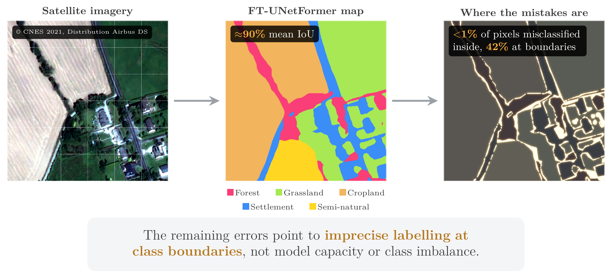

# Diagnosing a Label-Quality Ceiling in Imbalanced Rural Land-Cover Segmentation



Code accompanying the manuscript *Diagnosing a Label-Quality Ceiling in Imbalanced Rural Land-Cover Segmentation*.
Using high-resolution Pléiades satellite imagery and a fixed FT-UNetFormer, two off-the-shelf data-curation levers
(cross-dataset transfer from OpenEarthMap and a class-balanced sampler) are evaluated in a 2×2 factorial over ten
seeds. Cross-dataset transfer is the dominant lever and improves every class on validation, while the class-balanced
sampler is largely redundant once transfer is applied. The residual error is diagnosed as a label-quality ceiling
concentrated at class boundaries, rather than a limit of model capacity or the imbalance method.

Built with PyTorch 2.9, PyTorch Lightning 2.3, and Rasterio 1.4 on Python 3.11; the environment is pinned in
`environment.yaml`.

## Setup

```bash
conda env create -f environment.yaml
conda activate label-quality-ceiling
```

## Reproduce

A single script runs the whole pipeline end-to-end from raw data:

```bash
bash RUNBOOK.sh              # everything from scratch
bash RUNBOOK.sh --from B1    # resume from training
bash RUNBOOK.sh --from C1    # resume from evaluation
```

Evaluate the shipped model on the held-out test set (add `--tta` for the reported test-time-augmentation number):

```bash
PYTHONPATH=. python evaluation/compute_metrics.py \
  --split test --base-dir model_weights/biodiversity/stage3_clsbal \
  --data-root data/biodiversity_split/test
```

Rebuild every paper figure:

```bash
python scripts/figures/build_all_figures.py
```

`RUNBOOK.md` is the detailed walkthrough: each stage (teacher build, student lineage, class-balanced sampler weights,
evaluation), the stage→config map, and the `--from` resume points. The A1–A6 robustness analyses live in
`scripts/analysis/`; the figure map is in [docs/FIGURES.md](docs/FIGURES.md).

## Data availability

The Biodiversity dataset is proprietary and not publicly available; it was acquired under licence from ODOS
Technologies and cannot be redistributed. OpenEarthMap is public at
[open-earth-map.org](https://open-earth-map.org). Pre-trained checkpoints are not redistributed. Users with licensed
access should place files as follows:

| Asset | Location |
|-------|----------|
| Biodiversity imagery & masks | `data/biodiversity_raw/` |
| Biodiversity train/val/test split | `data/biodiversity_split/` |
| OpenEarthMap raw tiles | `data/openearthmap_raw/` |
| OEM relabelled (6-class) | `data/openearthmap_relabelled/` |
| OEM filtered subset | `data/openearthmap_filtered/` |
| Stage checkpoints | `model_weights/biodiversity/<stage>/` |
| OEM teacher weights | `pretrain_weights/` |
| Stage 3 sampler weights (clsbal) | `artifacts/sampler_weights_clsbal.tsv` |
| Pre-computed evaluation outputs | `evaluation/evaluation_results/` |

The RGB+NIR 4-channel ablation (the near-infrared null result discussed in the paper) is kept on the
`experiment/rgb-nir` branch, since the 4-channel data path is not backward-compatible with the RGB pipeline used for
the reported results.

## Acknowledgements

The FT-UNetFormer implementation derives from ODOS Technologies'
[GeoSeg-Biodiversity](https://github.com/odostech/GeoSeg-Biodiversity). The proprietary Biodiversity dataset was
provided by ODOS Technologies under licence. The underlying Pléiades satellite imagery is © CNES 2021, distribution
Airbus DS; it is proprietary and is not distributed in this repository, which shares only code and imagery-free
derived outputs.

## Licence and citation

Code is released under the MIT Licence (see `LICENSE`). The datasets and satellite imagery are not covered by this
licence and remain proprietary. Citation details will be added upon publication.
